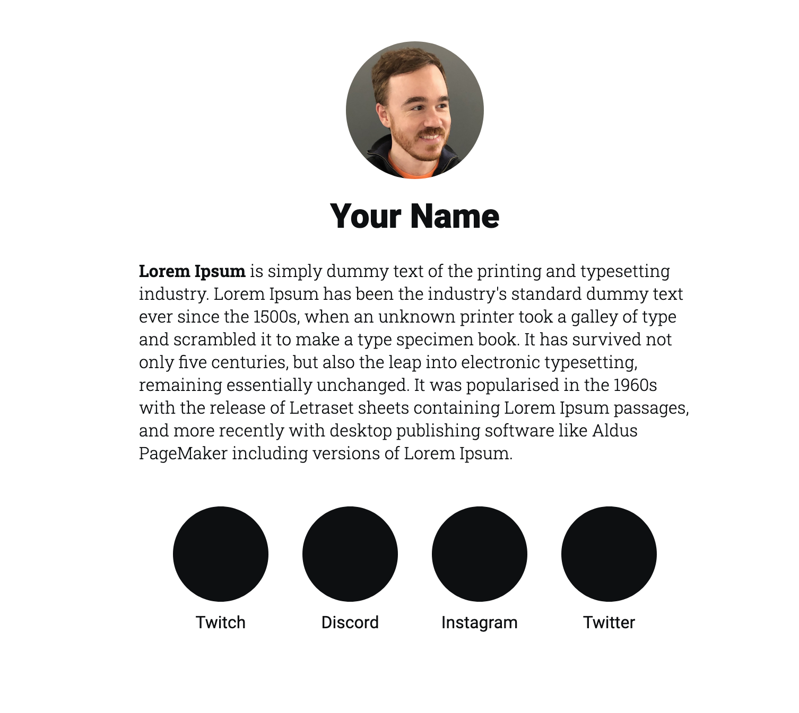

 

# Bio Webpage Template
This repo is a template for a basic bio webpage that you can use as a starting
point for your own. Sites like [Linktree](https://linktr.ee/) are a simple way to keep all your links
in one place but fall short if you’d like any customization or to use your
own custom domain. Using [Github Pages](https://pages.github.com/) and this
template, you can create your own with a custom domain in just a few minutes.

## Getting Setup
1. Click the "Use this template" button on this page
2. Name your new repository <your-username>.github.io
3. Done! You should be able to access your new webpage at http://<your-username>.github.io

## Configuring a custom domain
If you would like to have your own domain name point to this new webpage then
you'll need to buy one first. I reccomend using https://iwantmyname.com/. After
acquiring the domain name, it's an easy settings change on your new repo. For
more information, see [Configuring a subdomain](https://help.github.com/en/github/working-with-github-pages/managing-a-custom-domain-for-your-github-pages-site#configuring-a-subdomain)

## Reporting Issues
I've created this template in my spare time to share with everyone in the hopes
that it makes creating your own bio webpage a little easier. If you run into
any problems, create an issue on the [issues page](https://github.com/JZimz/bio-template/issues) for this repo.
Please be patient and I'll try to help out as soon as I can.

## Support
If you found this helpful, here are some ways you can throw some support my way:
- Follow me on [Twitch](https://www.twitch.tv/jzimz)
- Follow me on [Instagram](https://www.instagram.com/jzimz.tv/)
- Subscribe to my [YouTube channel](https://www.youtube.com/channel/UCxyaFKlRSXJ-D0-UICa6W3g)
- [Donate](https://streamelements.com/jzimz/tip)
